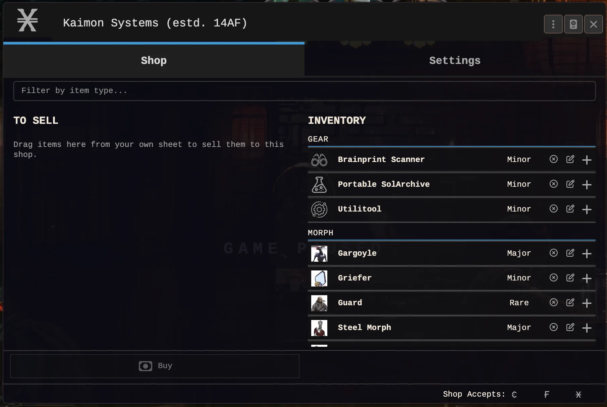
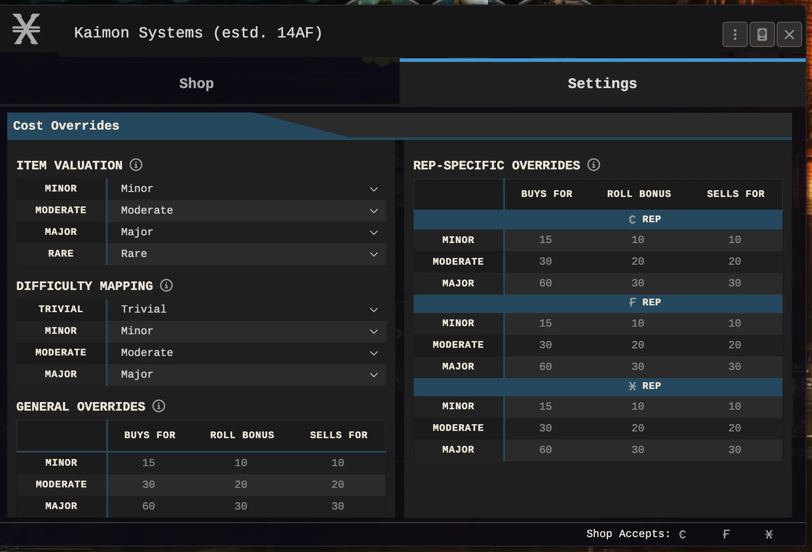
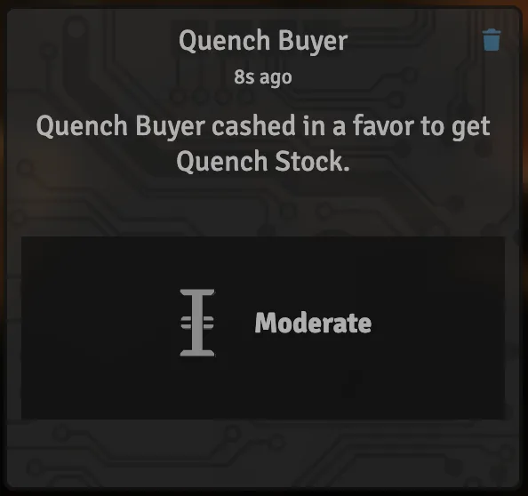

# Eclipse Phase — Shops

Shops for the [Eclipse Phase](https://github.com/Artemystra/eclipsephase) system for Foundry VTT:
stock management, Rep-based purchases, favors, selling and shop loyalty.

Requires the Eclipse Phase system in version 2.5 or later. The module contributes its own actor
sub-type, `eclipsephase-shop.shop`, and registers against the system's public extension API
(`game.eclipsephase.api`) rather than patching it.

## Features

### Shopping With Your Social Score


*The shop sheet as a player sees it: the shop's stock on the right, their own basket on the left*

Eclipse Phase has no shopping lists and no price tags, and this module does not invent any. A shop
holds items, every item carries a cost level rather than a number, and what a character can get out
of it depends on how well they are regarded in the network the shop trades in.

There are two ways through the door. **Cashing in a favor** is the RAW route: the character calls in
their standing on a rep network, rolls for it, and burns rep on a success. **Buying** is the flat
house rule for tables who would rather not roll every time, and it can be switched off entirely if
your table wants the book's version and nothing else. Selling works the same way in reverse and is
always open, whatever else you switch off.

Which networks a shop trades in is up to the shop. The footer says so at a glance, and a character
who has no standing in any of them is welcome to browse and nothing more.

<p>      </p>

Selling is a drag: pull items over from a character sheet, they collect in the basket on the left,
and what sits there also sweetens the favor roll if the character would rather trade than pay.
Buying picks from the shop's own list instead. Morphs are ordinary stock too, cost levels and all,
for the tables that let their players resleeve on the open market.

### Every Shop is Different


*The Settings tab: what a cost level means, what it costs, and what it pays back*

A back-alley fixer on Mars and a Titanian cooperative should not feel like the same vending machine,
so almost nothing about a shop's economy is fixed. Every shop carries its own settings tab, and the
defaults are only a starting point.

**Item Valuation** and **Difficulty Mapping** re-point the cost levels themselves: a shop that treats
everything Major as merely Moderate is a shop with good connections, and one that pushes Minor goods
up to Major is a shop that knows it is the only game in the habitat. **General Overrides** then set
what each level actually costs to buy, what it pays when sold, and what bonus the favor roll gets.

If that is still not specific enough, **Rep-Specific Overrides** do the same thing per network. The
same shop can be generous to the anarchists it grew up with and merciless to anyone walking in on
c-rep, and the numbers say so rather than the GM having to remember it.

Nothing here needs to be touched to play. Leave the tables alone and every shop behaves identically,
which is exactly what a table that just wants to buy a gun would want.

### Let's Chat About Commerce



Trading happens in the middle of a session, often while everyone is talking about something else, and
a transaction that quietly succeeds is a transaction somebody will ask about twenty minutes later.

So every purchase, sale and favor writes its own card: who did it, what they got, which network paid
for it and at what cost level. A favor roll that came out badly can still be rescued with a pool
spend straight from the card, and the purchase then completes from there rather than needing to be
started again.

<br clear="left">

## Installation

Install by manifest URL:

```
https://raw.githubusercontent.com/Artemystra/eclipsephase-shop/main/module.json
```

## Disabling or removing the module

The shop is an actor type this module owns, so switching the module off leaves those actors with a
type nobody provides. Foundry then reports one console error per shop on world load and hides them.
**Nothing is lost:** the data stays in the world untouched, and switching the module back on brings
every shop back exactly as it was.

To remove the module for good, delete the shop actors **while the module is still active**, then
disable it.

## Settings

Two house rules ship switched **on**, each switchable on its own under Game Settings:

| Setting | What it controls |
|---|---|
| **Allow buying with Rep** | The Buy and Trade routes, and the "Buys For" column of the rate tables |
| **Allow trading morphs** | Stocking, buying and asking for morphs, and the Morph Point override section |

Neither is RAW. Selling is unaffected by both and is always available.

## Extending the shop

Another module can add a payment route without patching the sheet. The shop's own "Cash in Favor"
and "Sell" are registered the same way, and "Buy" (the flat-Rep house rule) is registered too.

```js
Hooks.once("ready", () => {
  const shop = game.modules.get("eclipsephase-shop").api;

  shop.registerPurchaseMode({
    id: "my-module.barter",
    label: "my-module.shop.barter",
    order: 40,                       // ascending; the shop's own routes sit at 10, 20 and 30
    footerButton: "shop-cart-action",
    available: context => !context.isOwnerView && context.hasSelection,
    execute: context => myBarterFlow(context.shop, context.character)
  });
});
```

`available(context)` must return `true` for the route to be offered. The context describes the
shop as the sheet currently sees it: `sheet`, `shop`, `character`, `isOwnerView`,
`purchaseNetworks`, `hasSelection`, `hasStaged` and `salesOpen`.

Two more seams:

- **Hook** `eclipsephase-shop.prepareContext(sheet, context)` fires as the last step of the shop
  sheet's context preparation, for adding fields a slot template needs.
- **Slots** `shop.footer.buttons` and `shop.settings.sections` are rendered by the shop's own
  templates. Fill them with the system's slot registry
  (`game.eclipsephase.api.registry.registerSlot`), remembering to preload your template, since
  slots render as synchronous Handlebars partials.
